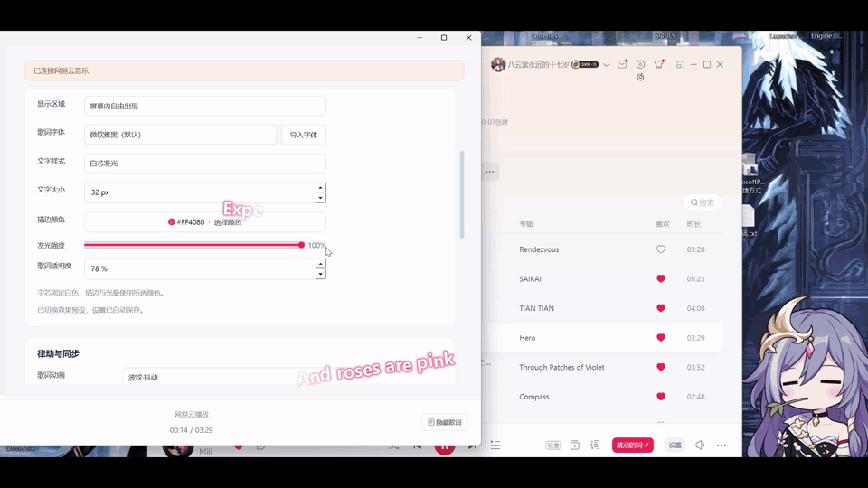

# 都市回响

让歌词在桌面随音乐跳动。支持网易云联动、逐字动画、字体效果、预设及主题切换。



桌面实机录屏，约 18 秒，循环播放（GIF 无声）。

**[下载 Windows x64 试用版](https://github.com/Celine258/idea-from-limbus-company-dancing-lyrics/releases/tag/v0.6.0-beta.2)** · [问题反馈](https://github.com/Celine258/idea-from-limbus-company-dancing-lyrics/issues)

[观看 30 秒无音乐演示](https://github.com/Celine258/idea-from-limbus-company-dancing-lyrics/releases/download/v0.6.0-beta.2/dancing-lyrics-demo-30s.mp4)

1. 下载 `dancing-lyrics-0.6.0-beta.2-windows-x64.zip`，完整解压到长期保留且可写的目录。
2. 完全退出网易云（包括托盘），双击 **安装网易云联动.bat**，在窗口点击安装。
3. 重开网易云，点击播放栏的“都市回响”；右键或点击“设置”调整效果。
**注意版本注意版本****最好取消自动更新**
无需 Python 或 Git。请下载 ZIP 成品，页面的 Source code 是源码。同一个 ZIP 自动识别 **网易云 3.1.40.205461／3.1.41.205529 x64**。已验证 Windows 11 x64、BetterNCM 1.3.4；其他网易云版本停止安装并提示。尚未在第二台干净电脑完成试装。**注意版本注意版本**

更新：退出网易云和歌词程序，新包覆盖原目录并再次安装，保留 `.state`。
卸载：完全退出网易云后运行 **卸载网易云联动.bat**，保留个人设置、字体、预设和共用框架。
安装后移动程序需重新安装。

插件数据目录请保留默认 `C:\betterncm`，或选择英文路径。BetterNCM 1.3.4 在中文数据路径下无法可靠解包，安装器会提前提示；歌词程序及网易云本身可以放在中文目录。

详细流程见 [使用说明](release/使用说明.txt)。自有源码采用 [MIT](LICENSE)，运行组件保留 [第三方许可](THIRD_PARTY_NOTICES.md)。

macOS：已整合社区适配代码，提供独立入口及 [macOS 安装与验证说明](MACOS.md)。
当前为**实验源码支持，尚未完成 macOS 真机播放验证**；Windows 下载包不适用于 Mac。
Intel 与 Apple Silicon 的适配器及共用绘制自动测试已通过，安装方式和待验收项目见上述说明。

## 贡献者

- [@qingyin-alice-zhong](https://github.com/qingyin-alice-zhong)：macOS 初始适配、独立启动入口、系统播放信息读取与平台界面适配方案。
- [@Celine258](https://github.com/Celine258)：项目创作与维护、macOS 代码整合、可靠性修正及 Windows 回归验证。

## 功能与使用

应用版本 **0.6.0-beta.2**。侧栏显示“创作者：Bilibili-鈴仙優昙華院因幡”和版本号，标语为 **FACE THE SIN. SAVE THE E.G.O**。左侧下方可选择“默认主题／深色主题／特殊主题”，立即生效并自动保存，重启后保留选择。默认主题和深色主题保留原外观；特殊主题采用 Limbus Company 风格的黑金配色、切角双层边框和机械图纸底纹。

特殊主题将侧栏、窗口、运行中的 Windows 任务栏及系统托盘图标换为但丁钟头；切回默认或深色主题恢复红色波形图标。后台运行时托盘也显示当前主题图标。主题不改变歌词颜色、字体、动画、效果预设、播放进度或独立的预览背景；更新保留已有选择。安装目录里的 EXE 文件图标仍为原图标，未运行时的固定快捷方式由 Windows 管理。

在“歌词效果 → 律动与同步”开启“逐字演唱强调”，可让当前唱到的字或词平滑放大；白芯发光模式同时增强当前光晕。默认关闭，不改变原动画和音乐播放。状态显示“逐字时间可用”“部分歌词可用”“本曲无逐字时间”或“等待歌词”；只强调网易云实际提供且能准确匹配的时间单位，无数据或无法对齐的行继续原动画。英文通常按整词强调，不猜测每个字母的时间。效果预览使用明确标注的演示时间，不代表当前歌曲数据。

“歌词效果”顶部提供“安静办公”“轻快律动”效果预设，以及“另存为预设”“更新当前预设”“删除”。预设组合字体、文字和全部动画参数；显示区域、同步偏移、音量、预览背景保持当前值。内置方案只读，自己的方案支持确认后更新或删除；手动调整会显示“已修改”，不自动覆盖已保存的方案。自己的方案重启后可选，字体不可用时恢复微软雅黑并提示重新导入。

在“歌词效果 → 律动与同步”可以调节入场和退场速度（25%–300%，100% 为原有效果）、抖动频率（每秒 1–15 次采样）及跌落距离（0–128px，以 32px 字号为基准）。数值越高入退场越快，短句会自动压缩时长。不适用于当前动画的参数置灰并保留设置；跌落距离为 0 时仍逐字淡出。动画参数、深浅背景预览和“重播动画”位于同一分组，调整立即生效并自动保存。

Windows 桌面音乐伴侣：透明置顶、鼠标穿透，歌词随机出现在屏幕两侧，整句倾斜，单字随音乐强弱跳动并逐渐淡出。

现已支持网易云音乐 Windows **3.1.40.205461／3.1.41.205529（64 位）** 联动：通过网易云播放栏的“都市回响”按钮开启桌面效果，右键该按钮或点击旁边的“设置”，直接打开“歌词效果”页。歌曲、歌词和进度来自网易云，音乐仍由网易云播放。安装、更新和回滚见 [网易云联动说明](NETEASE.md)。

## 源码与开发版启动

双击项目根目录的 **启动.bat**，优先打开已打包的桌面版；也可以直接运行 **dist/FloatingLyrics/FloatingLyrics.exe**，无需安装 Python。请保留旁边的 `_internal` 文件夹。

没有打包版本时，启动脚本会改用源码；首次使用需要联网安装依赖。直接运行源码的命令见下文。源码开发使用 Python 3.11，目标系统为 Windows 10/11。

启动期间命令行会显示正在打开面板的提示，确认控制面板实际可见后再关闭。冷启动可能需要十几秒；启动失败时会保留错误信息，按任意键后关闭。启动器最多等待 30 秒，不会仅凭进程已创建就报告成功。

控制面板点击“试听内置演示”即可体验。演示是程序生成的 24 秒合成音乐与原创示例文字，供检查动画与同步。

界面采用浅灰背景、白色内容卡片和红色强调色。左侧“当前音乐”用于导入歌曲与歌词，“歌词效果”用于调整文字与律动；底部播放栏固定显示歌曲、播放进度、播放／暂停、歌词显示开关和音量。切换页面不会中断播放。

窗口默认约 1100×760，启动时会根据屏幕可用空间调整。缩小窗口后主内容可以滚动，底部播放栏保持可见；长歌曲名会省略显示，将鼠标放在名称上可以查看完整文件路径。

导入自己的音乐时，程序查找同目录同名 `.lrc`，例如 `歌曲.mp3` 与 `歌曲.lrc`。也可以点击“选择歌词”单独导入。LRC 按句同步；文字起伏由音乐能量驱动。

```text
[00:12.50]第一句歌词
[00:16.80]第二句歌词
```

- “隐藏歌词”保留音乐播放；暂停会冻结歌词动画。
- 收起或关闭控制面板后，在系统托盘图标上右键可打开面板、控制播放或退出。
- “显示区域”可切换屏幕两侧与屏幕内自由出现。
- “歌词字体”提供微软雅黑、宋体、楷体，附实时文字预览，文案为“啊，对了！但丁。有一天，去一趟图书馆吧。”。选择后立即应用并自动保存，只改变桌面歌词的字体。
- 点击“导入字体”选择 `.ttf`、`.otf` 或 `.ttc`，程序保存一份副本，重启或移动原文件后仍可使用。TTC 中的字体家族会分别加入列表；同一家族只显示一次。无效文件会在文字设置区域提示原因，保持已有选择。
- “文字样式”默认为“白芯发光”：固定白色字芯，自选“描边颜色”，同色光晕向外渐隐。“发光强度”可调 0–100%，默认 60%；调到 0 仍保留白芯和描边。描边和光晕范围按字号自动适配。
- 可切回“经典纯色”，使用原有文字颜色与深色描边，发光强度在此模式禁用。样式、颜色和强度立即生效并自动保存，旧设置继续使用原颜色作为发光样式的描边色。
- “白芯发光 → 发光风格”新增“卡门的声音”：固定暖白字芯与琥珀金光晕，发光强度仍可调。原有自定义颜色会保留，切回“标准白芯”或“经典纯色”即可继续使用；该选择可随效果预设保存。
- “歌词语言 → 有中文翻译时优先显示译文”默认关闭。勾选后逐句显示网易云已有的中文译文，无中文翻译的句子继续显示原文；不调用额外翻译服务。译文按整句同步，不套用原文逐字时间，字体与动画仍可自由选择。该语言开关独立于效果预设。
- “预览背景”可在深色和浅色之间切换，仅改变文字效果预览，不改变桌面背景或用户设置。预览与桌面歌词共用实际绘制方式，并显示当前透明度。
- “律动与同步 → 歌词动画”提供原有效果、波纹·波动、波纹·抖动、跌落·波动、跌落·抖动。更新默认保持原有效果；选择后立即应用并保存，可搭配任意字体及文字样式。
- 四种新动画都从左到右逐字淡入，在下一句开始时逐字退场。波纹原地淡出，跌落向下加速、轻微旋转并淡出；“波动”连续上下起伏，“抖动”是不规则但平滑衔接的颤动。多行按阅读顺序播放，空格不占动画时隙。
- “律动幅度”调节波动、抖动和原有跳动；调到 0 时新动画仍保留逐字淡入淡出和跌落。暂停冻结桌面画面，拖动进度直接定位到对应动画状态。
- 点击“重播动画”可循环查看入场、停留、退场，预览不控制音乐；隐藏预览或滚动至不可见时停止刷新。
- “同步偏移”正值表示歌词延后，负值表示提前；LRC `[offset:n]` 按正值提前处理。
- 无法获取音频律动时，可以手动切换到“轻波浪”模式。
- 默认主屏幕；上述网易云版本已接入可选 YRC 演唱时间，支持情况取决于具体歌曲。精准节拍检测与其他客户端版本留待后续。

设置和错误日志位于程序目录的 `.state`，不会修改系统 Python 环境。透明窗口是普通桌面置顶窗口；独占全屏应用等场景需另行验证。

“卡门的声音”实际绘制预览（深浅底色只用于查看效果）：


打包版日志：`dist/FloatingLyrics/.state/app.log`；源码日志：`.state/app.log`。日志记录启动时间和进程编号，便于排查打不开面板的情况。

## 开发与检查

```powershell
.\.venv\Scripts\python.exe main.py
.\.venv\Scripts\python.exe -m unittest discover -s tests -v
.\.venv\Scripts\python.exe main.py --smoke
```

`--smoke` 静音播放内置演示，检查真实音频解码、暂停、跳转、恢复、窗口标志和布局，同时检查两个页面在默认及最小尺寸下的控件可达性和固定播放栏，随后自动退出。检查报告和界面截图保存在 `artifacts`，不表示已人工听音或完成长时间稳定性测试。

静音检查还分别生成默认／深色／特殊主题的页面截图，验证侧栏、设置保存及歌词画面不变，检查 Qt 应用／窗口／托盘图标一致以及 Windows 原生窗口图标切换恢复。实际 BAT 入口仅在 `-Smoke` 模式下最多等待 120 秒完成这些扩展检查，普通启动仍以 30 秒判断窗口可见性。

发光检查包含样式画面变化、保存、暂停时钟不变及双句暖缓存绘制测试。报告中 `effect_benchmark` 记录 90 帧、整屏透明画布与逐句合成的绘制耗时，P95 目标 ≤33ms；该指标是本机软件绘制耗时，不等同于整机帧率或 GPU 合成耗时。`glow-dark.png`、`glow-light.png` 使用独立粉色演示设置展示深浅背景效果，不修改正常颜色。

动画检查另外记录 `animation_benchmarks`，分别测量四种模式、演唱同步开／关的八种组合，每种为 51 字符双句、90 帧；覆盖逐字透明度、强调缩放、光晕、旋转、整屏清空与句子合成，暖缓存 P95 目标同为 ≤33ms。`animation_style` 缺失或无效值默认 `classic`，`singing_sync` 默认关闭，不自动改变旧设置的体验。

四种动画的录制工具使用实际 Windows Qt 预览窗口，不播放或操作音乐：

```powershell
.\.venv\Scripts\python.exe tools\record_animations.py artifacts\animations-demo
python tools\encode_animation_recording.py artifacts\animations-demo
```

第一条加上 `--singing-sync` 可录制带中英文演示时间的强调效果。真实网易云检查使用 `--singing-smoke`，见 [联动验证说明](NETEASE.md)。

第二条命令只供开发者生成 GIF，使用本机已有 Pillow，不是应用运行依赖。录制每种动画 5.5 秒、30fps，原始窗口帧、原生可见性证据及四份动图保存在指定目录；使用独立粉色示例，正常颜色和设置不变。

字体验证还检查三个预置家族的实际匹配与歌词画面变化。传入 `--font-smoke-file tests/fixtures/lyrics-test.ttf` 可额外检查真实导入、选择保存及副本重载；验证使用独立的 `.state/smoke-fonts`，不修改正常字体库。

个人字体保存在 `.state/fonts`，自定义预设保存在 `.state/effect-presets.json`（打包版位于 `dist/FloatingLyrics/.state`）。更新时随原有设置完整保留。某款系统字体未安装时列表标注不可用；上次选定的个人字体缺失或损坏时回退至微软雅黑并提示。预设 JSON 损坏时保留原文件并提示，移走损坏文件后可重新保存。纯音乐与无歌词歌曲保持原有处理方式。

运行 `build.ps1` 可生成 `dist/FloatingLyrics/FloatingLyrics.exe`，需 Visual Studio C++ 工具及 Windows SDK 构建进程音频助手。分发时保留整个 `FloatingLyrics` 文件夹，其中包含 Qt 媒体插件、音频助手和演示资源。构建会备份旧包并保留用户设置。

本机的完整依赖快照保存为 `requirements-lock.txt`，便于复现构建环境。已有检查结果见《验证记录.md》。

设计细节见同目录的《产品设计方案》和《技术文档》。
