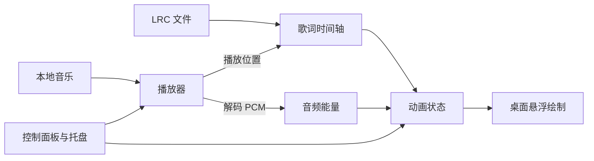

# 跳动的歌词：技术文档

版本：MVP v0.1 · 日期：2026-10-06 · 状态：第一版已实现，验证记录见《验证记录.md》。

## 1. 技术选型

| 层次 | 方案 |
| --- | --- |
| 开发基线 | Windows 10/11、Python 3.11；实际依赖版本在开发时锁定 |
| 桌面界面 | PySide6 Widgets：控制面板、透明悬浮窗口、系统托盘 |
| 音乐播放 | `QMediaPlayer` + `QAudioOutput` |
| 音频分析 | `QAudioBufferOutput` 获取解码 PCM，NumPy 计算能量 |
| 动画绘制 | `QPainter` 绘制字符，`QTimer` 请求刷新 |
| 配置保存 | `QSettings` 保存外观参数、区域和同步偏移 |
| 分发 | 原型验收后使用 PyInstaller 打包，目标电脑验证媒体插件与资源 |

音频数据接口自 Qt/PySide6 6.8 加入，且仅支持 FFmpeg 后端，因此该路径要求 PySide6 ≥ 6.8。开发时先验证真实音频缓冲可用，再锁定依赖版本。[Qt 官方说明](https://doc.qt.io/qtforpython-6/PySide6/QtMultimedia/QAudioBufferOutput.html)

## 2. 模块结构

```text
跳动的歌词/
├── main.py          # 启动与模块连接
├── player.py        # 本地播放、音量、进度和状态
├── lrc.py           # 歌词解析与时间查询
├── audio_energy.py  # PCM 格式转换、能量和平滑
├── animation.py     # 歌词生命周期、布局与字符运动
├── overlay.py       # 透明窗口与绘制
├── controls.py      # 控制面板与托盘菜单
├── settings.py      # 配置读取与保存
└── requirements.txt
```

以上模块已创建；另外增加 `validation.py`、启动脚本、打包脚本、演示资源及核心测试。应用无需服务器、数据库或模型 API。当前依赖锁定为 Python 3.11.8、PySide6 6.8.3、NumPy 1.26.4，打包使用 PyInstaller 6.11.1。



## 3. 歌词与时间同步

- 将 LRC 解析为 `LyricLine(start_ms, text)` 列表；支持一行多个时间标签，忽略标题、作者等非歌词标签。同一时间的文本合并展示，按时间排序。
- 优先读取 UTF-8/UTF-8 BOM，失败后尝试 GB18030；错误行报告并跳过，没有有效歌词时提示用户。文件的 `[offset]` 转成时间修正；面板偏移另用正值表示延后显示。
- 用 `QMediaPlayer.position()` 的毫秒位置作为主时间源，不能靠每帧累加时间决定歌词。该接口及 `positionChanged` 的单位由官方明确为毫秒。[播放器文档](https://doc.qt.io/qtforpython-6/PySide6/QtMultimedia/QMediaPlayer.html)
- 每句出场记录稳定的随机位置、角度和字符参数。同屏上限 2 句；下一句出现后前句进入淡出，遇到密集歌词及时淘汰最早实例。
- 单句最长显示约 6 秒，遇下一句或歌曲结束时提前退出；短句按可用时间缩短淡入和淡出。
- 暂停时冻结播放时钟与动画；继续时恢复。拖动进度、换歌或修改同步偏移时清空旧实例，查询当前位置并重建应显示的歌词。
- 约 30 FPS 刷新。为避免播放器位置通知间隔造成卡顿，在两次通知之间按单调时钟插值；每次通知校正，暂停与跳转时重设锚点。
- 暂停、隐藏、未导入歌词或歌曲结束时停止悬浮层的刷新定时器，减少后台空转；设置变化和进度跳转仍会触发一次重绘。

## 4. 随音乐跳动

连接 `audioBufferReceived`，根据缓冲的采样格式与声道布局转换样本，归一化后计算短时均方根能量：

```text
rms = sqrt(mean(samples²))
energy = clamp(归一化并平滑后的 rms, 0, 1)
wave_i = 0.6 + 0.4 × sin(ω × song_time − i × phase)
y_i = −max_jump × energy × wave_i
scale_i = 1 + 0.04 × energy
```

`i` 是字符序号，`song_time` 来自播放时钟。所有字符受到同一音频能量驱动，但相位不同，形成轻微波浪。用快速上升、缓慢回落的平滑减少抖动，静音时能量归零。第一版采用能量驱动；精准鼓点和逐字演唱同步需要后续加入节拍分析与逐字时间数据。

缓冲处理仅做短时计算，耗时分析放入工作线程；绘制留在界面线程。跳转、换歌后清除旧能量，音频分析不可用时在控制面板说明，并提供普通波浪动画选项。

## 5. 悬浮窗口与绘制

悬浮层使用 `FramelessWindowHint`、`WindowStaysOnTopHint`、`WindowTransparentForInput`、`WindowDoesNotAcceptFocus`，创建时设置 `WA_TranslucentBackground`。透明背景在 Windows 上需要无边框；输入穿透与不接受焦点有对应窗口标志。[Qt 窗口与属性说明](https://doc.qt.io/qt-6/qt.html)

实现时还在自身 Windows 窗口上设置 `WS_EX_NOACTIVATE`，并以 `SWP_NOACTIVATE` 刷新属性，补强恢复显示时的焦点保护。[Windows 官方窗口样式说明](https://learn.microsoft.com/en-us/windows/win32/winmsg/extended-window-styles)

控制面板是独立的可交互窗口，托盘负责打开面板、隐藏悬浮层和退出，避免穿透后失去操作入口。默认使用主屏幕 `availableGeometry()` 与逻辑坐标布局，屏幕分辨率或缩放变化时重新计算区域。

每次绘制先平移并旋转整句，再为各字符应用跳动与缩放；用 `QPainter.save()/restore()` 隔离变换。根据年龄计算淡入淡出透明度，过期后删除实例。

用字体度量计算文本布局，并把旋转、缩放、跳动余量纳入包围盒。随机候选位置最多尝试 12 次，避开已有句子；失败后改用空闲固定位置，必要时缩小字号或换行。保持同一实例的位置稳定，避免每帧重新随机。

## 6. 实施顺序与验收

| 阶段 | 交付与检查 |
| --- | --- |
| 1：桌面窗口 | 显示示例文字；在代码编辑器上验证透明、置顶、穿透、不抢焦点和托盘退出 |
| 2：音乐与歌词 | 接入本地播放和 LRC；检查暂停、拖动、换歌、缺失文件及同步偏移 |
| 3：视觉效果 | 加入随机布局、整句倾斜、真实音频驱动的逐字运动和淡出；检查静音与短句 |
| 4：可用性 | 加入外观设置与持久化；检查长句、125%/150% 缩放、隐藏恢复和打包后的播放 |

自动检查主要覆盖 LRC 解析与暂停/跳转后的时间轴查询；窗口体验、声音和动画通过 Windows 实机验证。同步目标为原型的句子触发偏差约 ≤ 200 毫秒，需实测确认，LRC 自身的标注误差单独记录。

实现中另附原创合成演示音乐与示例歌词，用于真实音频解码和 GUI 检查。实际歌曲由用户导入；持续播放 30 分钟、人工听音和不同机器的兼容性检查尚待完成。已有检查结果见《验证记录.md》。
