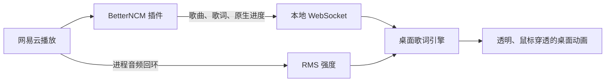
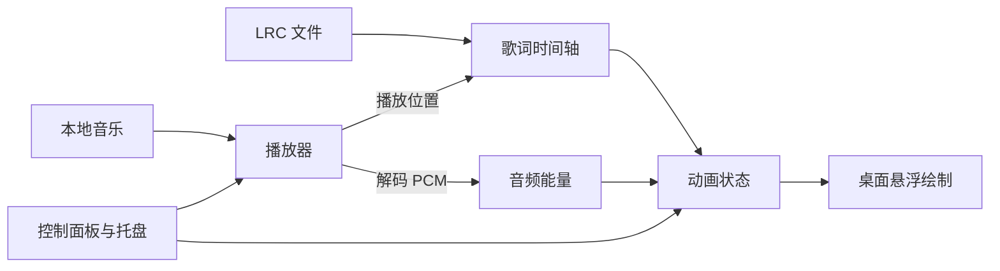

# 跳动的歌词：技术文档

版本：v0.4.0 · 日期：2026-10-07 · 状态：深浅主题、本地模式、动画参数与预设、网易云 YRC 演唱强调已实现，验证记录见 [验证记录](验证记录.md)。

网易云模式新增 BetterNCM 入口、当前播放器状态适配、本地 WebSocket 和进程音频能量助手，复用原歌词时间轴、透明绘制与设置。此模式不创建 `QMediaPlayer`，播放操作由网易云负责。协议、适配版本、安装及回滚见 [网易云联动说明](NETEASE.md)。



## 1. 技术选型

| 层次 | 方案 |
| --- | --- |
| 开发基线 | Windows 10/11、Python 3.11；实际依赖版本在开发时锁定 |
| 桌面界面 | PySide6 Widgets：控制面板、透明悬浮窗口、系统托盘 |
| 音乐播放 | `QMediaPlayer` + `QAudioOutput` |
| 音频分析 | `QAudioBufferOutput` 获取解码 PCM，NumPy 计算能量 |
| 动画绘制 | `QPainter` 绘制字符，`QTimer` 请求刷新 |
| 配置保存 | `QSettings` 保存外观参数、区域和同步偏移 |
| 分发 | 原型验收后使用 PyInstaller 打包，目标电脑验证媒体插件与资源 |

音频数据接口自 Qt/PySide6 6.8 加入，且仅支持 FFmpeg 后端，因此该路径要求 PySide6 ≥ 6.8。开发时先验证真实音频缓冲可用，再锁定依赖版本。[Qt 官方说明](https://doc.qt.io/qtforpython-6/PySide6/QtMultimedia/QAudioBufferOutput.html)

## 2. 模块结构

```text
跳动的歌词/
├── main.py          # 启动与模块连接
├── player.py        # 本地播放、音量、进度和状态
├── lrc.py           # 歌词解析与时间查询
├── audio_energy.py  # PCM 格式转换、能量和平滑
├── animation.py     # 歌词生命周期、布局与字符运动
├── overlay.py       # 透明窗口与绘制
├── controls.py      # 控制面板与托盘菜单
├── settings.py      # 配置读取与保存
├── fonts.py         # 字体家族、应用内导入与字体副本加载
├── text_effects.py  # 共享光晕缓存与逐句透明合成
└── requirements.txt
```

以上模块已创建；另外增加 `validation.py`、启动脚本、打包脚本、演示资源及核心测试。应用无需服务器、数据库或模型 API。当前依赖锁定为 Python 3.11.8、PySide6 6.8.3、NumPy 1.26.4，打包使用 PyInstaller 6.11.1。



## 3. 歌词与时间同步

- 将 LRC 解析为 `LyricLine(start_ms, text)` 列表；支持一行多个时间标签，忽略标题、作者等非歌词标签。同一时间的文本合并展示，按时间排序。
- 优先读取 UTF-8/UTF-8 BOM，失败后尝试 GB18030；错误行报告并跳过，没有有效歌词时提示用户。文件的 `[offset]` 转成时间修正；面板偏移另用正值表示延后显示。
- 用 `QMediaPlayer.position()` 的毫秒位置作为主时间源，不能靠每帧累加时间决定歌词。该接口及 `positionChanged` 的单位由官方明确为毫秒。[播放器文档](https://doc.qt.io/qtforpython-6/PySide6/QtMultimedia/QMediaPlayer.html)
- 每句出场记录稳定的随机位置、角度和字符参数。同屏上限 2 句；下一句出现后前句进入淡出，遇到密集歌词及时淘汰最早实例。
- 单句最长显示约 6 秒，遇下一句或歌曲结束时提前退出；短句按可用时间缩短淡入和淡出。
- 暂停时冻结播放时钟与动画；继续时恢复。拖动进度、换歌或修改同步偏移时清空旧实例，查询当前位置并重建应显示的歌词。
- 约 30 FPS 刷新。为避免播放器位置通知间隔造成卡顿，在两次通知之间按单调时钟插值；每次通知校正，暂停与跳转时重设锚点。
- 暂停、隐藏、未导入歌词或歌曲结束时停止悬浮层的刷新定时器，减少后台空转；设置变化和进度跳转仍会触发一次重绘。

## 4. 随音乐跳动

连接 `audioBufferReceived`，根据缓冲的采样格式与声道布局转换样本，归一化后计算短时均方根能量：

```text
rms = sqrt(mean(samples²))
energy = clamp(归一化并平滑后的 rms, 0, 1)
wave_i = 0.6 + 0.4 × sin(ω × song_time − i × phase)
y_i = −max_jump × energy × wave_i
scale_i = 1 + 0.04 × energy
```

`i` 是字符序号，`song_time` 来自播放时钟。所有字符受到同一音频能量驱动，但相位不同，形成轻微波浪。用快速上升、缓慢回落的平滑减少抖动，静音时能量归零。第一版采用能量驱动；v0.3 另接入可选 YRC 演唱强调，精准鼓点仍需后续节拍分析。

缓冲处理仅做短时计算，耗时分析放入工作线程；绘制留在界面线程。跳转、换歌后清除旧能量，音频分析不可用时在控制面板说明，并提供普通波浪动画选项。

## 5. 悬浮窗口与绘制

悬浮层使用 `FramelessWindowHint`、`WindowStaysOnTopHint`、`WindowTransparentForInput`、`WindowDoesNotAcceptFocus`，创建时设置 `WA_TranslucentBackground`。透明背景在 Windows 上需要无边框；输入穿透与不接受焦点有对应窗口标志。[Qt 窗口与属性说明](https://doc.qt.io/qt-6/qt.html)

实现时还在自身 Windows 窗口上设置 `WS_EX_NOACTIVATE`，并以 `SWP_NOACTIVATE` 刷新属性，补强恢复显示时的焦点保护。[Windows 官方窗口样式说明](https://learn.microsoft.com/en-us/windows/win32/winmsg/extended-window-styles)

控制面板是独立的可交互窗口，托盘负责打开面板、隐藏悬浮层和退出，避免穿透后失去操作入口。默认使用主屏幕 `availableGeometry()` 与逻辑坐标布局，屏幕分辨率或缩放变化时重新计算区域。

每次绘制先平移并旋转整句，再为各字符应用跳动与缩放；用 `QPainter.save()/restore()` 隔离变换。根据年龄计算淡入淡出透明度，过期后删除实例。

用字体度量计算文本布局，并把旋转、缩放、跳动余量纳入包围盒。随机候选位置最多尝试 12 次，避开已有句子；失败后改用空闲固定位置，必要时缩小字号或换行。保持同一实例的位置稳定，避免每帧重新随机。

字体设置新增 `font_family`，旧配置默认 `Microsoft YaHei UI`，原默认保留 DemiBold，其余家族使用常规字重。测量、字形路径与中英文预览使用同一字体构造方法；切换后清理布局缓存，不改变播放位置。包围盒同时覆盖逻辑字宽和实际路径，避免个人字体的外伸笔画越界。

字体库仅预置微软雅黑、宋体、楷体的系统家族引用。个人 TTF/OTF/TTC 通过 `QFontDatabase.addApplicationFontFromData()` 加载，读取文件后先验证，成功后按内容 SHA-256 命名并原子保存到 `.state/fonts`；失败不改变当前选择。启动时重载副本，TTC 各家族加入列表，家族去重，失效选择回退并提示。Qt 保持逐字符字体回退；字体不安装到系统，控制面板主题字体独立。[Qt 字体库说明](https://doc.qt.io/qt-6/qfontdatabase.html#addApplicationFontFromData)

`--font-smoke-file` 为本地静音和网易云联动验证的可选外部字体夹具路径。正常与验证字体目录分离，构建保留完整 `.state`。网易云插件协议及纯音乐处理不变。

外观新增 `text_style`（`glow`／`solid`）及 `glow_strength`（0–100，默认 60），缺失或无效样式默认白芯发光；原 `color` 在发光模式用作描边及光晕，在经典模式继续用作填充色。描边外露厚度为 `1.2 × 字号 / 32`，光晕有限支撑半径为 `8 × 字号 / 32`，单位为逻辑像素。

[文字效果模块](text_effects.py)将抗锯齿字形遮罩的 alpha 用 NumPy 做水平、垂直高斯卷积，sigma 为物理半径的三分之一，染为描边同色并保存为显式 RGBA 字节序的预乘 alpha 图像。缓存按实际路径元素、字体、字号、颜色及设备像素比分组，用 LRU 控制在 64MiB；强度只在合成时乘入，不重新模糊。空格不生成光晕。光晕支撑与实际图像舍入边界纳入布局、旋转及碰撞计算。

每个句子复用独立透明缓冲，逐帧清空后依次绘制所有字符的光晕、描边和白芯；字符位置及缩放仍使用歌曲时钟与声音强度。最后整句一次应用淡入淡出和总体透明度，避免邻字光晕覆盖白芯及每层独立透明造成颜色变化。`DevicePixelRatioChange` 清理旧缩放缓存和布局。预览共用此模块，背景选择仅存在于面板内存中。[Qt 高分屏图像说明](https://doc.qt.io/qt-6.8/qimage.html#setDevicePixelRatio)

[效果验证器](effect_validation.py)生成深浅背景截图并测试 51 个字符、双句、整屏透明画布的 90 帧暖缓存绘制；分别记录冷准备、暖缓存中位数、P95 和缓存字节数。它不包含 GPU／桌面合成耗时，也不代表整机帧率。网易云诊断选项 `--effects-smoke` 在实际播放期间检查设置与同步锚点，并调用相同验证器。

## 6. 四种逐字动画

`animation_style` 默认 `classic`，其他值为 `ripple_wave`、`ripple_shake`、`fall_wave`、`fall_shake`。旧配置缺失或无效值保留原整句动画。新增 [字符运动模块](glyph_motion.py)，以歌曲位置和稳定种子直接计算 `GlyphState`（位置、透明度、缩放、旋转）；不积累帧状态、不在每帧重新随机，因此暂停冻结，跳转后相同时间得到相同结果。

时间轴 `ActiveLine` 增加 `entry_end_ms`、`exit_start_ms`。新模式通常入场 700ms，最长为句间隔 35%；单字入场 140ms，剩余时间按可见字形簇均匀错开。下一句有内容时退场通常 600ms，最长为下一句间隔 45%；波纹单字退场 200ms，跌落 350ms，均限制在总时段内。单字句不等待错开。空白标签和歌曲结束前退场，未知时长最后一句仍用 6 秒兜底；新模式的长句持续到下一条标签，不沿用原模式 6 秒上限。最多两句，不叠加旧整句渐隐。

波动频率 1.5Hz，逐字相位错开 0.6 弧度；抖动以确定性整数哈希每秒生成 6 个偏移采样，使用 smoothstep 插值。幅度以原 `jump` 为上限，音乐能量乘入 `0.35 + 0.65 × energy`，保留基础律动；波动纵向系数 0.4，抖动横向 0.3、纵向 0.5。跌落位移为 `1.5 × 实际字号 × 退场进度²`，旋转为稳定符号的 `8° × 退场进度²`；将屏幕竖直位移换算到倾斜句子的局部坐标。

新模式准备完整预乘 RGBA 字符材质，分离不重叠的光晕和字身像素；先画所有光晕，再用字身遮罩排除白芯下的邻字光晕，最后绘制字身。逐字透明度乘入完整材质，总体透明度最后施加；强度变化只重组合成，不重做高斯模糊。复用句子缓冲，当前字符材质与缓冲不计入原有共享光晕 LRU 的 64MiB 限额。

布局和句子缓冲包含左右颤动、最大跌落、±8° 字符旋转和光晕舍入范围；窄边栏先额外预留运动宽度、缩小字号，极端长句仍无法倾斜容纳时将句子倾斜降为 0，避免越界。空白字形明确跳过绘制，但保留排版宽度。

面板预览共用运动和绘制模块，“重播动画”使用独立示例时钟，不改变播放器；隐藏或滚动不可见时停止预览计时器。新增 [动画性能验证器](animation_validation.py)，四种模式各测量 51 字符双句的 90 个暖帧，目标 P95 ≤33ms，记录冷准备、实际设备比例和缓存容量。网易云 `--animations-smoke` 检查设置与播放锚点，并让跌落·抖动参与随后暂停、跳转和切歌动作。

## 7. 参数、预设与演唱同步

应用品牌和版本集中在 [app_info.py](app_info.py)，Qt 应用元数据与侧栏均显示 0.4.0，网易云插件版本独立。[themes.py](themes.py) 用语义色值生成深浅 QSS 与 `QPalette`，覆盖页面、侧栏、底栏、控件、弹出选择与托盘菜单；自绘图标和进度条同步主题，主要按钮与进度保持红色。`theme` 配置为 `light`／`dark`，缺失或无效默认 `light`；主题不属于效果预设。切换只更新界面样式并保存，没有调用播放器或歌词层刷新，也不改变预览深浅选择。静音验证检查两套主题的默认与最小尺寸，网易云验证检查切换前后播放锚点、歌词文档及预览不变。

`entry_speed`／`exit_speed` 默认 100，范围 25–300；基准总时长和单字时长乘 `100 / speed`，逐字错开随总阶段同步改变，再应用原有 35%／45% 密集时间窗限制。经典基准入场 300ms、退场 600ms。`shake_frequency` 默认 6，范围 1–15，直接改变确定性采样时钟；`fall_distance` 默认 48，范围 0–128，位移为 `fall_distance × 字号 / 32 × 退场进度²`。预览与桌面共用 [字符状态](glyph_motion.py) 及时间轴，配置范围统一归一化。

[预设存储](presets.py)保存除 `region`、`delay_ms`、`volume`、`theme` 之外的视觉字段，文件为设置目录 `effect-presets.json`，包含版本号 1 和自定义列表；内置项驻留代码、只读。类型和版本校验失败时保留文件并提示；成功写入先创建同目录临时文件再原子替换，失败不改内存方案。界面用 `QSignalBlocker` 批量同步控件后一次保存与刷新，不操作播放器；缺失家族通过已有字体库回退，手动修改标记当前方案已修改。

插件 0.1.3 从当前歌曲 `yrcInfo.yrc` 解析句首与句长的方括号标记，以及 `(单位绝对起点,时长,0)文本`，时间均为毫秒，只追加可选 `words`。每单位保存 `{start_ms,end_ms,text_start,text_end}`，文本范围按 Unicode 码点而非 JavaScript UTF-16 单元计算。与当前行的完整原文匹配并选择句首差不超过 250ms 的唯一最近候选；无法对齐保留整句。原生 LRC 已由客户端减去偏移，YRC 在客户端 `scrollable` 时减一次相同秒级偏移转毫秒。字段缓存包含原歌词行、YRC、偏移与可滚动状态，支持同曲迟到时间数据。协议仍为 1，旧插件无 `words` 时兼容。

Python 扩展 `TimedWord` 与 `LyricLine`／`ActiveLine.words`，桥接按行逐项校验原文范围、有限时间和正区间，坏的可选字段被忽略；用户同步偏移与文档偏移同时作用于句首和词区间。布局字形簇记录原文码点范围，包含换行、空格和 emoji，软换行不改变索引；一个词的所有相交字形在同一原始时间段强调，不平均拆分。

`singing_sync` 默认关闭。当前区间两端用 smoothstep 平滑过渡，窗口为 `min(80ms, 区间长度 / 4)`；最大缩放增量 8%，间隙无强调。发光准备阶段复用原模糊缓存并保存最多 1.4 倍、上限 100% 的光晕材质，帧合成时在原强度和峰值间插值，不逐帧模糊；原值 0 不生成光晕，经典纯色只缩放。字芯及描边不变，字符透明度乘完整材质，最终统一应用整体透明度。边界包含强调、最大跌落、字符旋转及光晕。

强调由歌曲位置直接计算，暂停使用冻结时钟，跳转可直接重建；同一原文仅迟到词数据时保留布局和位置。切歌或断连清除模型，界面分别报告完整、部分、无数据或等待歌词。预览使用明确标注的中英文演示数据且独立计时，只在可见时刷新。`--singing-smoke` 对真实歌词检查收数与强调，不使用演示数据宣称客户端支持；八组合性能检查和真实宿主驱动见 [联动说明](NETEASE.md)。

## 8. 实施顺序与验收

| 阶段 | 交付与检查 |
| --- | --- |
| 1：桌面窗口 | 显示示例文字；在代码编辑器上验证透明、置顶、穿透、不抢焦点和托盘退出 |
| 2：音乐与歌词 | 接入本地播放和 LRC；检查暂停、拖动、换歌、缺失文件及同步偏移 |
| 3：视觉效果 | 加入随机布局、整句倾斜、真实音频驱动的逐字运动和淡出；检查静音与短句 |
| 4：可用性 | 加入外观设置与持久化；检查长句、125%/150% 缩放、隐藏恢复和打包后的播放 |

自动检查主要覆盖 LRC 解析与暂停/跳转后的时间轴查询；窗口体验、声音和动画通过 Windows 实机验证。同步目标为原型的句子触发偏差约 ≤ 200 毫秒，需实测确认，LRC 自身的标注误差单独记录。

实现中另附原创合成演示音乐与示例歌词，用于真实音频解码和 GUI 检查。实际歌曲由用户导入；持续播放 30 分钟、人工听音和不同机器的兼容性检查尚待完成。已有检查结果见《验证记录.md》。
